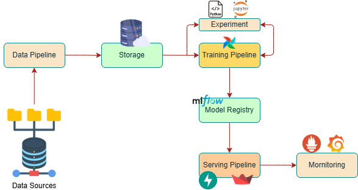

# Simple MLOps Pipeline
*Knowledge provided by* [AI VIET NAM](https://aivietnam.edu.vn/) 

<div style="text-align:center">

</div>

---
A simple project on building an MLOps pipeline. The main purpose of the project is to explore tools and basic deployment processes.

+ **Tools**: Airflow, MLflow, FastAPI, Streamlit

## Overview

-   I build and train a ResNet model from scratch for a classification task, using **Airflow** to manage the project's workflow. During the training process, I use **MLflow** for tracking.
-   For the backend, I use **FastAPI** for deployment, and for the frontend, I use **Streamlit**.
-   Monitor: **Prometheus, Gafana** (updating)
---
## Airflow
```
> git clone https://github.com/mminh007/MLOps.git
> cd ./flatform/airflow

# Set the UID of the user to the .env file
> echo -e "AIRFLOW_UID=$(id -u)" > .env

# Start the service
> docker compose up -d --build
```
Go to `https://localhost:8080` to access the airflow UI

$\bullet$ Username: `airflow`

$\bullet$ Password: `airflow`

_________
## MLFlow
```
> cd ./flatform/mlflow

# start the service
> docker compose -d ---build
```
